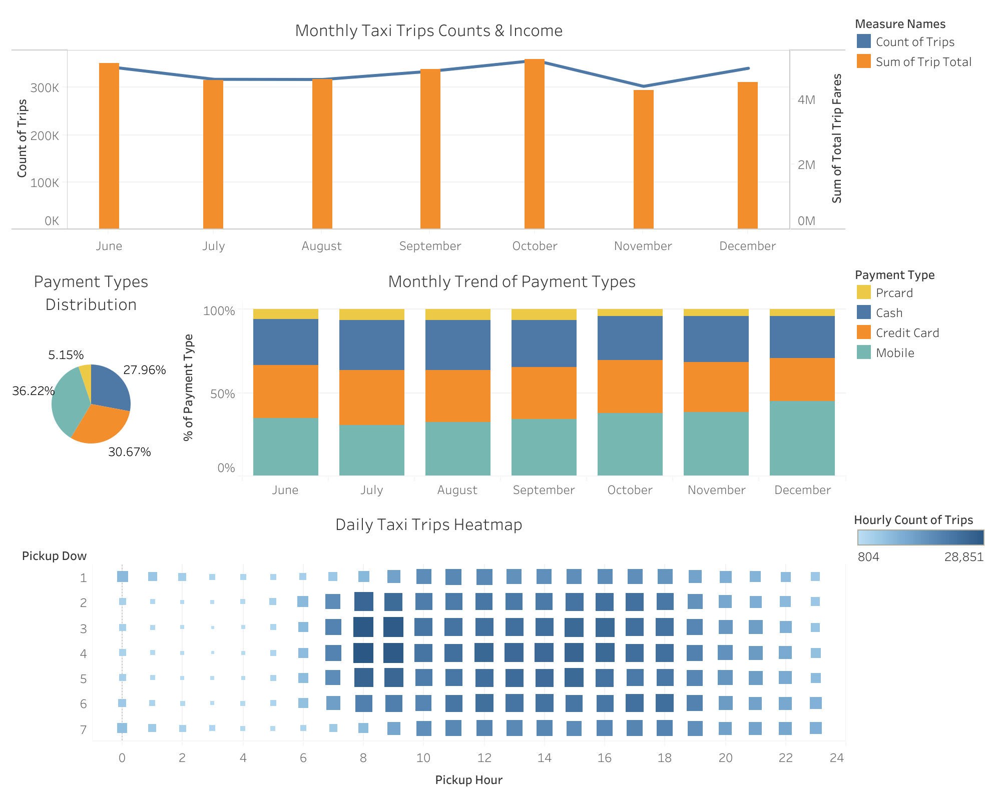
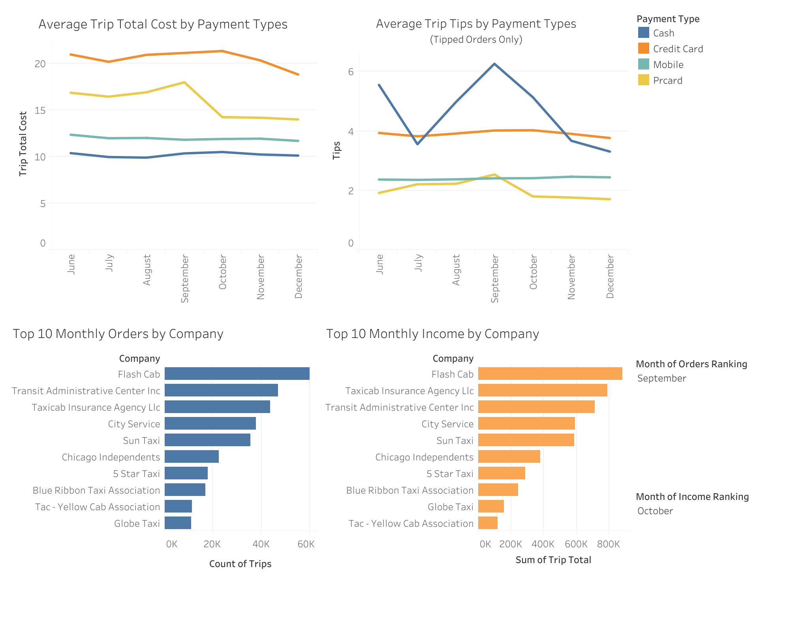

# chicago_taxi_trips_analysis
A pipeline based on AWS framework, Airflow, and Tableau using Chicago Taxi Trips data from June to December 2025.

## Dashboard
The analytics layer of the project is built in Tableau. The dashboard provides interactive exploration of Chicago Taxi trip behavior across time, payment types, and companies.

### Key Insights Covered
 - Trip volume trends by month and day of week
 - Hourly demand heatmap (DOW × Hour)
 - Top 10 taxi companies by monthly order volume or income
 - Payment type distribution and trend
 - Average trip total and tip amount by payment type

[Dashboard 1 (Overall Volume Analysis of Trip Data)](https://public.tableau.com/views/ChicagoTaxiTrips_17722357735190/Dashboard1?:language=en-US&:sid=&:redirect=auth&:display_count=n&:origin=viz_share_link)

[Dashboard 2 (Payment Types & Companies Analysis)](https://public.tableau.com/views/ChicagoTaxiTrips_17722357735190/Dashboard2?:language=en-US&:sid=&:redirect=auth&:display_count=n&:origin=viz_share_link)

## Infrastructure
