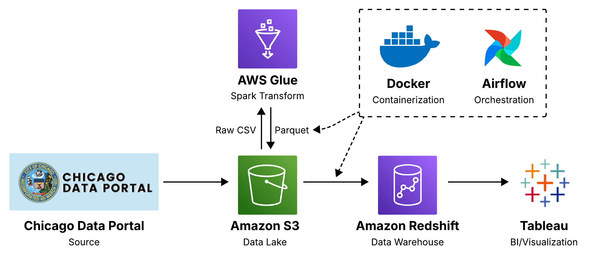
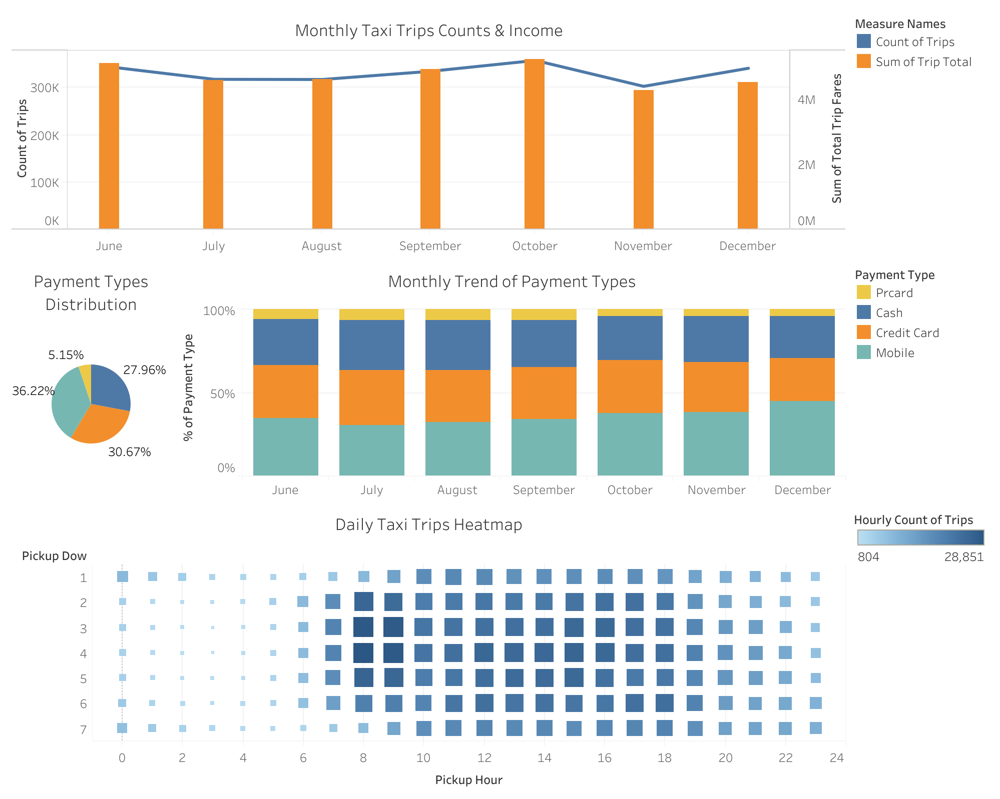
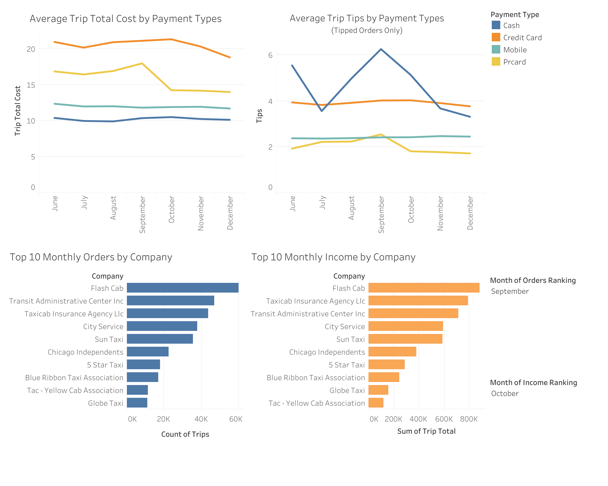

# Chicago Taxi Trips Pipeline
A production-style AWS data pipeline built using S3, AWS Glue (Spark), Amazon Redshift, Airflow (Dockerized), and Tableau.
The project processes Chicago Taxi Trips data from June 2025 to December 2025, implementing a raw → silver → warehouse → BI architecture.

## Infrastructure & Dashboard Overview

[Dashboard 1 (Overall Volume Analysis of Trip Data)](https://public.tableau.com/views/ChicagoTaxiTrips_17722357735190/Dashboard1?:language=en-US&:sid=&:redirect=auth&:display_count=n&:origin=viz_share_link)

[Dashboard 2 (Payment Types & Companies Analysis)](https://public.tableau.com/views/ChicagoTaxiTrips_17722357735190/Dashboard2?:language=en-US&:sid=&:redirect=auth&:display_count=n&:origin=viz_share_link)

## Data Source
The dataset comes from the Chicago Data Portal Taxi Trips (2024-) dataset. I manually downloaded monthly CSV files using the portal UI:
 - Time range: June 2025 - December 2025
 - Each monthly file: ~300MB, ~500k-600k rows

## Data Lake Architecture (Amazon S3)
### Raw Layer
Original CSV files are uploaded to S3 without transformation.
Example path:
s3://chicago-taxi-trips-guanyiw/raw/year=2025/month=06/taxi_2025_06.csv
### ETL Layer (AWS Glue + Spark)
AWS Glue (Spark) is used to transform raw CSV into clean Parquet format.
#### Transformations Applied
1.	Schema enforcement (explicit StructType definition)
2.	Data profiling checks
3.	Column name normalization
4.	Type casting to correct numeric and timestamp types
#### Partition & Write Strategy
 - Partitioned by year and month
 - One optimized Parquet file per month
 - Snappy compression

## Data Warehouse Architecture (Amazon Redshift)
Redshift is used as the analytics warehouse. The Parquet files are loaded using COPY.
### Star Schema Modeling
Dimension Tables of date, company, and payment type were made. Company names were standardized before dimension creation to handle inconsistent formatting. A new star-schema fact table was created to implement surrogate keys.

## Orchestration (Airflow + Docker)
Airflow is containerized locally using Docker.
### DAG Flow
The execution steps include:
 - S3KeySensor: Waits for monthly raw CSV to appear in S3
 - GlueJobOperator: Runs Spark job (raw → silver transformation)
 - PythonOperator: Validates silver Parquet file exists and is not empty
 - PostgresOperator: Creates fact table (If not exists - Idempotency) & COPY from S3 to Redshift

## Dashboard(Tableau)
The analytics layer of the project is built in Tableau (Extract mode connected to Redshift).
### Dashboard 1 - Overall Volume Analysis
 - Monthly trend
 - Day-of-week × hour heatmap
 - Demand distribution
### Dashboard 2 — Payment & Company Analysis
 - Payment type distribution
 - Average trip total & tips by payment type
 - Top 10 companies by month